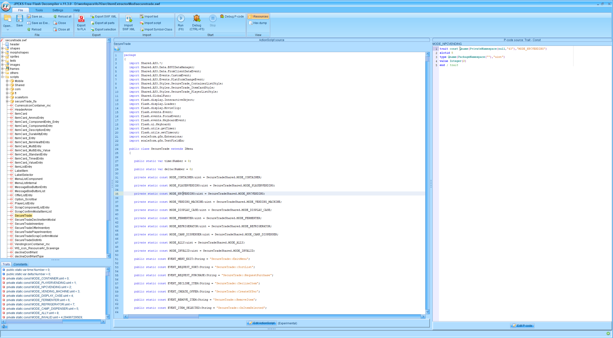
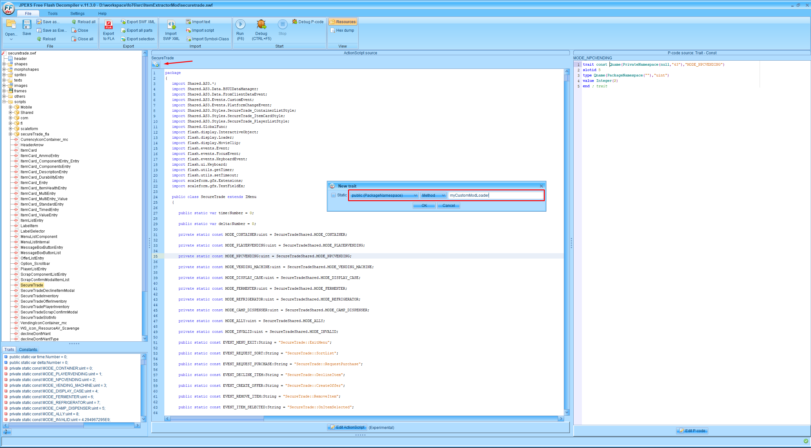
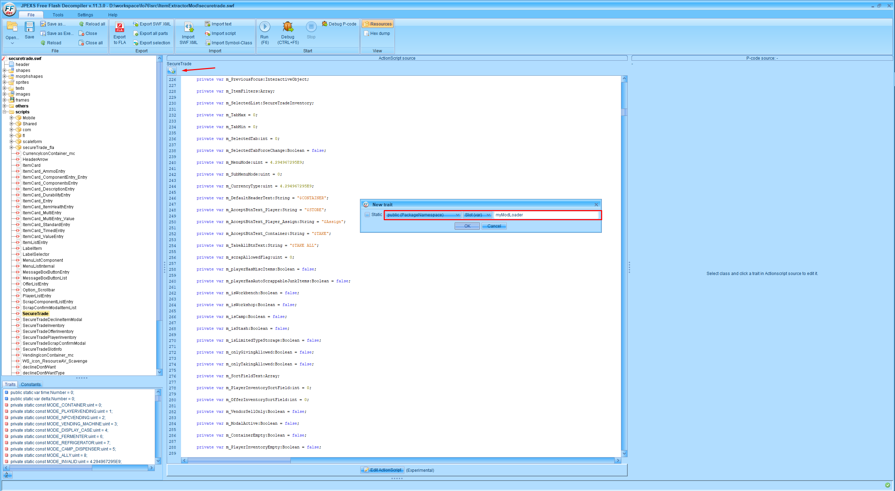
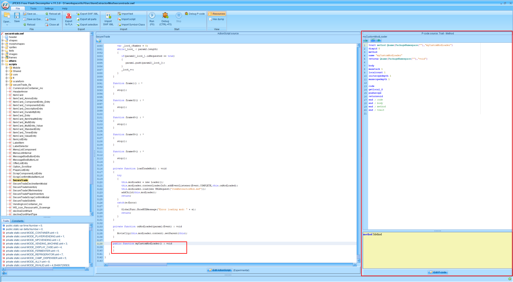
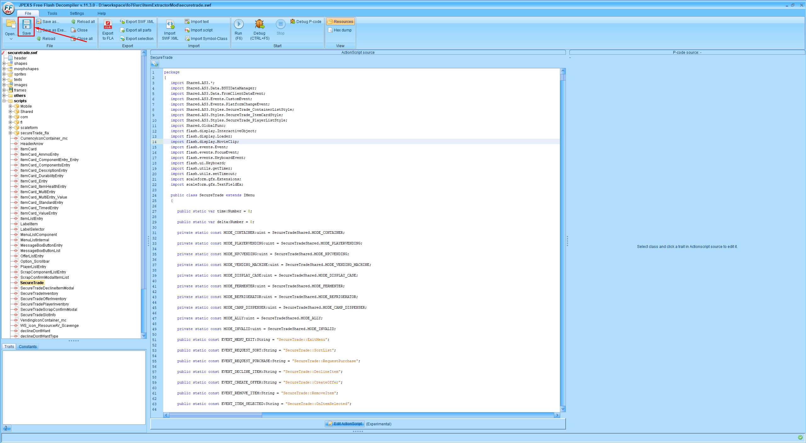

# HUD Modding guide for Fallout 76

Disclaimer:

I'd like to share the way I'm creating hud mods for Fo76.
I'm not a pro with action script 3 and flash itself(also with modding), so probably something in this guide can be done better or in a totally different way, but still I think it worth sharing.

## Requirements

##### General knowledge

1. Familiar with programming
2. Be able to read(and write) & understand action script code
3. Strong debugging skills
4. Optional bash/cmd/powershell scripting for automation build process

##### TOOLS

List of required tools (I'm using all of them, but if you don't like any of them - you may use any similar you can find).

1. BA2 archive extractor (I'm using https://github.com/AlexxEG/BSA_Browser, but any other should work).
2. BA2 archiver - I'm using the one that comes with Fallout4 Creation Kit
3. FFDEC - free flash decompiler: https://github.com/jindrapetrik/jpexs-decompiler
4. Adobe flash or Adobe Illustrator - non-free program to compile your mod (you may get 7 day trial from the official website)
5. IDE or editor that supports as3 syntax (I'm using Intellij IDEA Ultimate. There is a community version which is free, but I'm not sure whether it supports as3)

Optional:
1. Git bash: https://git-scm.com/downloads - I do not like windows cmd/powershell, I'm using linux for most of my work, and I'm automating most of the routine process.
2. nodejs: https://nodejs.org/en/ - the only reason for using this is automation, there is a npm package, that can compile your mod via single command
3. flc: https://www.npmjs.com/package/flc - globally installed via `npm i -g flc` - the package described above. 
4. Any archiver to bundle your mod, so you could upload it on nexus (it supports only archives as uploaded items)

## Modding

Formats:

**.ba2** - Bethesda's archive format

**.swf** - Adobe Flash format for actual action script code & graphics, media, etc.

**.fla** - Adobe Flash project format (used by Adobe Flash and/or Adobe Illustrator)

**.as** - file with action script source code

Languages:

**Action Script 3** - pretty old language, that is used for writing code, that will be compiled into swf.

### tl;dr

1. Find parent swf file
2. Insert loader for you custom swf
3. Compile your custom swf, e.g. your mod
4. Put parent swf(updated with your loader), and your mod into appropriate directory
5. Make a ba2 archive out of that
6. Install the mod, start testing
7. Fix the issues
8. Publish on nexus
9. You're done!

### Long version

Before starting actual modding, make sure all the required software works for you.

1. First should be an idea of mod.
2. Then you should think what HUD menu will fit it the best.
3. This part may be hard enough - find swf file that is responsible for the HUD menu you're trying to modify.

All the game swf files are located in your `Fallout 76/Data` directory.

File `SeventySix - Interface.ba2` should be opened via BA2 extractor tool you're using.

I'd suggest extracting every single swf file from this archive, 
using FFDEC you may write down a small script that will recursively run over all the swf's and convert it into fla project, which could be opened via tool #4.

Converted SWF to FLA project can be compiled back, but in 99% cases you will see a lot of issues, e.g. fonts are missing, something else is not working, etc. 

To create your custom mod you should follow those steps:

1. Find original game SWF file, that loads the content you'd like to modify.
2. Using FFDEC open main file (in most cases main file is the same as swf file name).
e.g. for `securetrade.swf` main file is `SecureTrade.as`


3. Add a new trait for your mod loader:

Specify that you're going to add new method, and its name.
    - I'd also recommend adding additional trait for the loader itself.
    
    - By default, FFDEC will assign int type to this variable, you have to find its definition in the code, click on it, then click on "Edit P-code" on the right side bar.
    Ignore warning, while clicking on edit P-code. 
    Replace entire default P-code with this(replace <yourVariableName> with actual value, you've specified in the previous step):
    ```
   trait slot Qname(PackageNamespace(""),"<yourVariableName>")
   slotid 0
   type Qname(PackageNamespace("flash.display"),"Loader")
   value Undefined
   end ; trait
   ```
   - Click save

4. If you've done everything correctly you will see a new empty method at the bottom of the file.


5. Click on the method name, so you could see a P-Code on the right side bar. Then click "Edit P-code", to be able to put content of the method.

    I'll provide most generic P-code, that should work for the most cases (if you will need something specific - you will have to dig into that manually).

    [Loader method p-code](guide/pcode/loaderMethod.txt)

    ***NOTE***: Replace, `myCustomModLoader`, `MyMod.swf`, `modLoader` with you actual values!

    `myCustomModLoader` - name of the Loader method

    `MyMod.swf` - name of your compile mod

    `modLoader` - name of the Loader variable

6. Once you're done, click on the save button to save all of your changes in the original swf.
